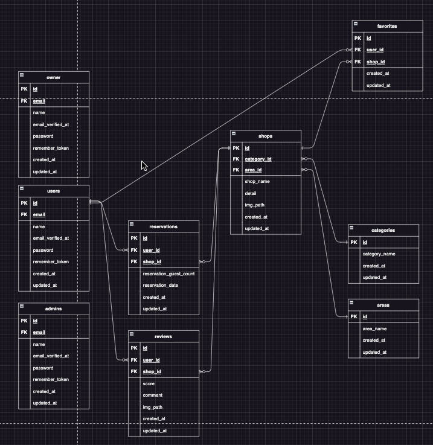

# proTest
<h1>開発環境構築</h1>
<ul>
    <li>githubからファイルをローカルへ 
        　URL->https://github.com/NaoyaKatsumata/proTest
    </li>
    <li>クローンしたフォルダに移動</li>
    <li>dockerが起動しているのを確認し、ビルド 
        　docker-compose up -d --build
    </li>
    <li>composerをインストール 
        　docker-compose exec php bash 　composer install
    </li>
    <li>.envファイルをコピーし編集 
        　cp .env.example .env 
        　nano .env 
        　(テキストエディタがない場合はインストール) 
        　apt install nano  
        　.env編集箇所 
        　DB_CONNECTION=mysql 
        　DB_HOST=mysql 
        　DB_PORT=3306 
        　DB_DATABASE=laravel_db 
        　DB_USERNAME=laravel_user 
        　DB_PASSWORD=laravel_pass 
    </li>
    <li>keyの作成 
        　php artisan key:generate
    </li>
    <li>npmのインストール 
        コンテナから出る 
        　exit 
        srcに移動 
        　cd src 
        npmをインストール 
        　npm install
    </li>
    <li>npmを起動 
        　npm run dev
    </li>
    <li>ダミーデータの投入 
        　phpコンテナに移動 
        　docker-compose exec php bash 
        　データ投入 
        　php artisan migrate 
        　php artisan db:seed
    </li>
    <li>
        ストレージとリンク 
        　php artisan storage:link
    </li>
</ul>
<h1>使用技術</h1>
<ul>
    <li>laravel：9.52.16</li>
    <li>php：8.1.30</li>
    <li>composer：2.8.1</li>
    <li>DB：Mysql</li>
</ul>
<h1>ER図</h1>

<h1>URL</h1>

開発環境:http://localhost

<h1>csvファイルフォーマット</h1>

店舗名,店舗詳細,カテゴリーID,エリアID

カテゴリーID(1:寿司,2:焼肉,3:居酒屋,4:イタリアン,5:ラーメン)

エリアID(1:東京,2:大阪府,3:福岡)
